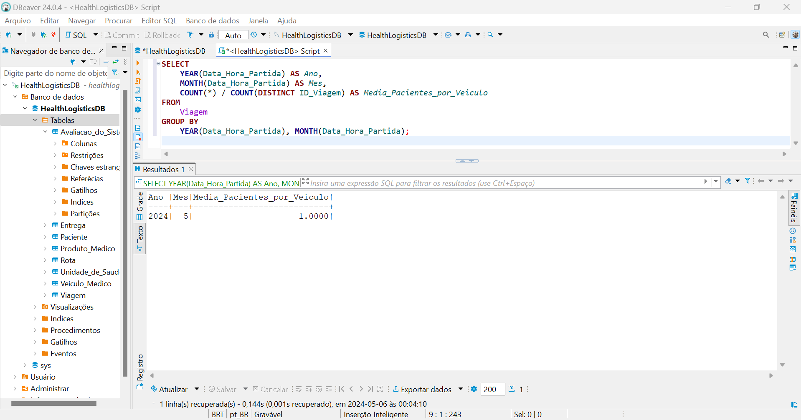

# Modelando dados e fazendo deploy em Nuvem

1. Na pasta ```scripts``` estão os scripts que usei no [DBeaver](https://dbeaver.io/) para criar e popular as tabelas;

2. As tabelas foram criadas a partir do mapeamento disponível no arquivo ```mapeamento.md```;

3. As informações sobre a RDS estão na pasta ```RDS``` (o arquivo ```HealthLogisticsDB.md``` apresenta as informações do banco de dados e informações necessárias para a conexão);

4. O modelo logico (```ModeloLogico.png```) está dentro da pasta ```imagens```;

5. Para apresentar a lógica "Calcule o número médio de pacientes transportados por veículo por mês", utilizei essa query:

```sql
SELECT 
    YEAR(Data_Hora_Partida) AS Ano,
    MONTH(Data_Hora_Partida) AS Mes,
    COUNT(*) / COUNT(DISTINCT ID_Viagem) AS Media_Pacientes_por_Veiculo
FROM 
    Viagem
GROUP BY 
    YEAR(Data_Hora_Partida), MONTH(Data_Hora_Partida);
```

6. O resultado obtido foi:

<div align="center">
  <sub>Print da tela do DBeaver</sub><br>
  <br>
</div>


Curti bastante fazer essa ponderada :)